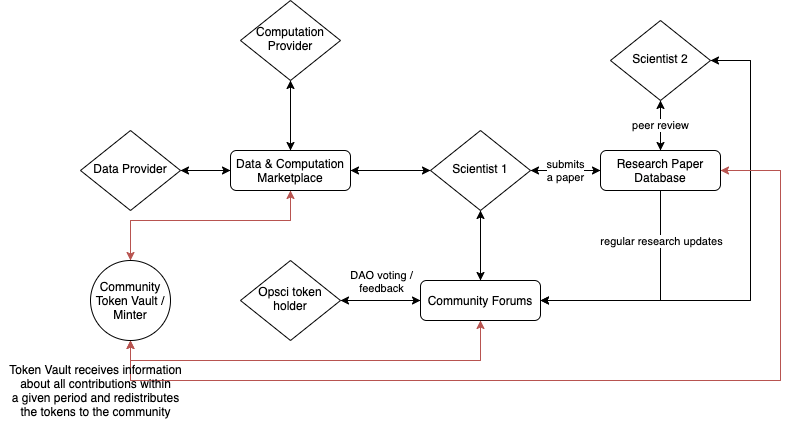

# Opscientia Open Web Fellowship: Token Communities
  name: Jakub Smekal, email: jakub.smekal@gmail.com, location: Durham, United Kingdom, timezone: GMT, discordID: #3317, discourseID: 
  smejak, current role: student, Natural Sciences, Durham University, 2nd year
  
  mentor: Shady El Damaty, category: token-community
  
  ## Overview

  The goal of this project is to research value representation in a decentralized science ecosystem that incentivizes active participation in high-quality scientific research and the community that benefits from it. 
  
  In area-specific decentralized systems such as open science, one of the main problems is the representation of value for the different goods and services that are used/produced within them. For instance, in open science, storage of data and computation act as commodities that need to be properly represented in order to provide the incentive for trade. As a result, a decentralized ecosystem needs a token that appropriately represents the underlying value of all assets. Furthermore, such a system needs to efficiently record all participants' contributions and accordingly distribute rewards, therefore it's important to identify what contributions are desirable, how to reward them and in what time frame.

  By identifying this problem, I propose a project exploring different open science ecosystems by simulating different combinations of stakeholders, the actions they can take, and the rewards they would receive for actively participating in the community.
  
  
  ## Implementation Plan

  This project will identify the key commodities in a decentralized science ecosystem, which are subsequently going to be used to construct the system's objective function. The objective function is essentially the goal of the system as a whole and it determines the actions that should to be taken by different stakeholders and the rewards that each stakeholder receives for participating. For further details, I recommend [this article](https://blog.oceanprotocol.com/token-engineering-case-studies-b44267e68f4) from the Ocean Protocol.

  Using the TokenSPICE simulator, I will design and run simulations for different token ecosystems with multiple agents to test the system's longevity and expansive potential. For this, I will need to define the goals of a decentralized science system and the corresponding KPIs that will be used to measure that. TokenSPICE already offers a wide variety of agents that can be used to model different token systems.

  The data from the simulations can be used to create different charts depicting the aggregate income/expenditure for the different tasks specified. An example from a simulation on web3 sustainability loop is shown below.
  

  The TokenSPICE simulator can be found [here](https://github.com/tokenspice/tokenspice).

  The implementation will go as follows:
  1. identify the objective and reward functions for an open science ecosystem (will be used as a metric to track the success of the open science token community)
  2. identify stakeholders and their potential contributions
  3. represent reward for contributing as a token/multiple tokens
  4. either find existing TokenSPICE agents or develop new ones that correspond to all stakeholders
  5. develop a netlist connecting all agents and giving them appropriate rewards at each step
  6. run the simulations with all netlists
  7. identify the optimal token community based on constraints defined in the objective function.

  Steps 3-6 can be repeated several times.
  
  ### Minimum Deliverables

  The minimum outcome of this research will be a report on the findings from the various token community simulations. The report should serve as not only an overview of the possible token ecosystems for optimal research incentives, but also as a guide for anyone wanting to conduct similar research, since TokenSPICE is a relatively new tool and still under development.
  
  #### Aim/Deliverable 1

  The first aim of this project is to concretely define the objective function of an open science system and develop different multi-agent communities centered around a token. Furthermore, this project will look into tokens as a representation of value for different commodities, such as computing or storage, to determine whether it is better to have a single token for everything, or perhaps different tokens providing different incentives.

  Throughout the project, I will use the [TokenSPICE simulator](https://github.com/tokenspice/tokenspice), written in the Python programming language. This research will encompass the development of new agent classes for the TokenSPICE simulator and new netlists, which define how the agents are connected within the ecosystem. An example of an ecosystem from the Ocean Protocol and a possible open science community is shown below.
  
  
  

  The results of the research will be interpreted with KPI's that are to be determined at the beginning of the project. For a decentralized science community, some indicators of a successful token system might include *number of research papers published (measured through a staking mechanism)*, *income of researchers*, *time (how long does the community thrive? Does the income of researchers vary?)*, etc.
  
  #### Aim/Deliverable 2
  
  The next aim of the project is to extend the research of multi-agent cryptoeconomic communities further, develop new systems based on the feedback from the initial simulations and perhaps provide feedback to the TokenSPICE community where appropriate. After this project has finished, its conclusion should be a detailed report on my findings.
  
  ### Timeline

| Week      | Activity |
| ----------- | ----------- |
| 1      | Deliverable : get familiar with TokenSPICE and begin the development of the first token ecosystem  |
| 2      | Deliverable :  set KPI's, sources of value/commodities, reward functions, schema of first token ecosystem  |
| 3      | Deliverable : complete the development of the first token ecosystem and run the simulation |
| 4      | Deliverable : evaluate the results of the first simulation, begin developing new agent classes for different token communities |
| 5      | Deliverable : new agent classes, schema of new token ecosystems |
| 6      | Deliverable : development of ecosystems, simulations, **Mid-term performance review / community feedback** |
| 7      | Deliverable : evaluation of simulations, improvement of agents/netlists |
| 8      | Deliverable : a graph of all simulations run so far with their respective parameters, design of an optimal ecosystem based on previous experiments |
| 9      | Deliverable : development of the final netlist and simulation |
| 10      | Deliverable : evaluation of the simulation, identify areas to improve |
| 11      | Deliverable : create a guide for using TokenSPICE, |
| 12      | Deliverable : final project report,   **Submit Final Report + Code/Materials on Discourse #pulse**    |

### Plan for Communication with Mentor

Communication with the mentor will take place online, primarily via Zoom and Discord. Regular meetings would initially be held weekly and in the second half of the fellowship on a bi-weekly basis. Furthermore, I would regularly update my mentor through text and additional meetings may take place if they are required.

### Plans to Continue with Project

I am extremely interested in the development of a more efficient and fair science community and I would very much like to contribute to its development even after this fellowship.

## Candidate Details

### Motivation

I believe science will greatly benefit the adoption of blockchain technology and decentralization in general. Opscientia's mission strongly coincides with my personal values and modeling token ecosystems can provide real insight into how to develop the best possible decentralized science community.

### Background

I an undergraduate mathematics and physics student and I presume these fields will help me in solving the problem of modeling token communities and value representation. Furthermore, I have experience with machine learning development and data analysis in Python, which may also prove useful when working with TokenSPICE.

### Working time and commitments

I plan on devoting 15-20 hours per week on this project. During the fellowship, I will be attending university where I am a full-time student, however, I see no reason why I cannot fit this commitment into my schedule. If any issues arise, my first point of contact would be my mentor.

### Curricula Vitae

[CV](https://drive.google.com/file/d/1slxxukIgx6tDw3eqXy2s9hnNnEU-wSEK/view?usp=sharing)

### References

[TokenSPICE](https://github.com/tokenspice/tokenspice)
